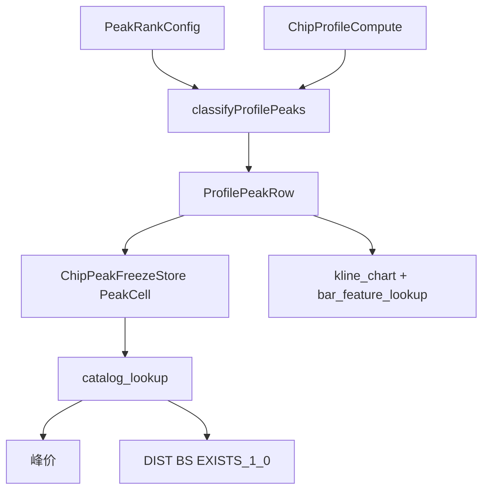

# 筹码峰回测变量体系设计方案（v2，已按代码审核定调）

## 设计目标

- **不变**：[`chip_profile_compute.dart`](CHAN_RUST/flutter/chan_kline/lib/compute/chip_profile_compute.dart) / Rust [`chip.rs`](CHAN_RUST/rust/chan_data/src/chip.rs) 的分桶累加；[`ChipProfileData.peakIndices()`](CHAN_RUST/flutter/chan_kline/lib/widgets/kline_chip.dart) 的局部峰判定。
- **可变**：[`profile_peak_classify.dart`](CHAN_RUST/flutter/chan_kline/lib/compute/profile_peak_classify.dart) 的编号规则；[`signal_data_catalog.dart`](CHAN_RUST/flutter/chan_kline/lib/backtest/signal_data_catalog.dart) 的变量登记与解析；[`chip_peak_store.dart`](CHAN_RUST/flutter/chan_kline/lib/backtest/chip_peak_store.dart) 的冻结字段。
- **原则**：K0 单钟、当步冻结、**峰价**无峰 = unavailable（不填 0、不沿用）；tooltip 与公式同源。
- **引擎约束（定调）**：条件 AST 仅 [`TradeCmpAst`](CHAN_RUST/flutter/chan_kline/lib/backtest/condition_ast.dart) / `TradeEventAst`；[`isNumericComparableType`](CHAN_RUST/flutter/chan_kline/lib/backtest/signal_data_catalog.dart) 不含 `TradeValueType.boolean`（枚举存在但全仓未用）。**不新增 TradeBoolAst**。

---

## 一、新增配置（设置面板，筹码/笔数峰共用）

在 [`chip_config.dart`](CHAN_RUST/flutter/chan_kline/lib/models/chip_config.dart)（或独立 `peak_rank_config.dart`）增加：

| 字段 | 类型 | 默认 | 说明 |
|------|------|------|------|
| `peakRankMode` | `spatial` / `volume` | `spatial` | 编号模式；改模式清空冻结仓 |
| `maxOuterRank` | 3..7 | **5** | 外侧 ±n 上限（由现 ±3 扩到 ±5） |
| `maxInBoxRank` | 1..5 | **3** | 框内多峰档数 |

**设置弹窗文案**：

- **空间序**：`-1` = 低价之下离低价最近峰；`+1` = 高价之上最近峰；框内 `IN1..` = 离收盘由近到远；无后缀 `PEAK` = `IN1`。
- **量级序**：各区内按峰位 `total` 从大到小编 `-1/+1/IN1..`；**切换后所有 `PEAK`/`INn`/`Mn`/`Pn` 语义均变**（见第七节）。
- 切换模式或改档数 → 与改桶宽一样，**整仓 `clear()` 重算**（与现有 `ChipPeakFreezeStore` 机制一致）。

持久化：`.chan_chip_config.json`（[`chip_settings_store.dart`](CHAN_RUST/flutter/chan_kline/lib/settings/chip_settings_store.dart)）。

---

## 二、编号规则（改造 `classifyProfilePeaks`）

签名扩展（所有调用点必须传入，含 [`kline_chart.dart`](CHAN_RUST/flutter/chan_kline/lib/widgets/kline_chart.dart) ~1057）：

```dart
List<ProfilePeakRow> classifyProfilePeaks({
  required ChipProfileData profile,
  required double low,
  required double high,
  required double close,
  required PeakRankMode mode,
  required int maxOuterRank,
  required int maxInBoxRank,
});
```

### 2.1 空间序（`spatial`，默认）

- 框下/框上：与现逻辑一致（离边界由近到远 `-1..` / `+1..`）。
- 框内多峰：`IN1..INmax` 按 `|price - close|` 升序。
- **`SUB.K0.CHIP.PEAK`（无后缀）= `IN1`**：与现 [`pickProfilePeakPrice`](CHAN_RUST/flutter/chan_kline/lib/backtest/chip_peak_store.dart) 框内取离收盘最近 **兼容**（仅 spatial）。

### 2.2 量级序（`volume`）

各区内按 `profile.total[i]` 降序；tie-break 用空间序保证确定性。此时 `PEAK`/`IN1` = 框内最强峰，**不再**等于离收盘最近。

### 2.3 variableId 形态（两段式）

**峰价（4～5 段）**

| 显示名 | token | variableId |
|--------|-------|------------|
| K0筹码峰（别名） | （空） | `SUB.K0.CHIP.PEAK` |
| 框内1 | `IN1` | `SUB.K0.CHIP.PEAK.IN1` |
| 框下1 | `M1` | `SUB.K0.CHIP.PEAK.M1` |
| 框上2 | `P2` | `SUB.K0.CHIP.PEAK.P2` |

**衍生（6 段）**：`SUB.K0.CHIP.PEAK.{token}.{field}`，`field` ∈ `DIST` | `EXISTS` | `BS`。

---

## 三、variableId 解析全链路（硬伤修复，必做）

现状：[`parseChipPeakVarId`](CHAN_RUST/flutter/chan_kline/lib/backtest/signal_data_catalog.dart) 仅 `parts.length` 4 或 5，且 token 仅 `^[MP]\d+$`（**不含 INn**）。`SUB.K0.CHIP.PEAK.M1.DIST` 为 **6 段**，`lookupTradeVariable` / `compileBinaryOp` → `tryBind` 会 miss。

**定调实现**（三条链路同步）：

1. **`parseChipPeakVarId` 扩展或拆分**
   - 5 段：`SUB.K0.CHIP.PEAK` / `.IN1` / `.M1` / `.P1`（token 正则扩为 `IN\d+` | `M\d+` | `P\d+`）。
   - 6 段：新增 `parseChipPeakDerivedVarId` → `(kn, kind, token, field)`，`field` 仅允许 `DIST|EXISTS|BS`。
2. **`lookupTradeVariable` / `_chipPeakDef`**
   - 峰价：`_chipPeakDef(kind, suffix/token)` 循环至 maxOuter/maxInBox。
   - 衍生：`_chipPeakDerivedDef(kind, token, field)`，`valueType` 均为 **numeric**（见 3.2）。
   - `description` 按 `peakRankMode` 分 spatial/volume 两套（volume 下禁止写「框内取离收盘更近」）。
3. **[`catalog_lookup.dart`](CHAN_RUST/flutter/chan_kline/lib/backtest/catalog_lookup.dart) `_chipPeakPlotSeries`**
   - `rest` 解析：`CHIP` + `PEAK` + optional `token` + optional `field`。
   - 有 `field` 时从 `PeakCell` + `bars[x].close` 派生，不另冻序列。


---

## 四、回测变量清单

筹码峰 / 笔数峰镜像两套。

### 4.1 峰价（numeric / price）

- `PEAK` + `PEAK.IN1..IN3` + `PEAK.M1..M5` + `PEAK.P1..P5`（每类 14 个）。
- **`PEAK` 与 `PEAK.IN1` 双条目**：spatial 下同值；表单可对 `PEAK` 标注「同 IN1（仅空间序）」，展示可能重复，可接受。

### 4.2 衍生变量（定调：EXISTS = numeric 1/0）

| field | 类型 | 计算 | 可用性 |
|-------|------|------|--------|
| `DIST` | numeric | `close - peakPrice` | 无该峰 → **unavailable** |
| `EXISTS` | **numeric**（非 boolean） | 有峰 `1`，无峰 `0` | **永远 available** |
| `BS` | numeric | `b / s`（峰位桶） | 无峰或 `s≤0` → unavailable |

**DIST 文档**：正 = 收盘在峰价上方；负 = 下方。引擎**无 abs()**，「距某峰 0.5 元以内」应写：

`EXISTS == 1 AND DIST >= -0.5 AND DIST <= 0.5`

（勿写「`DIST <= 0.5` 即距支撑 0.3 元内」——对 P 系或收盘在峰下方会误导。）

**EXISTS 用法**：仅支持与数值常量比较，例如 `SUB.K0.CHIP.PEAK.M1.EXISTS == 1`。禁止 `EXISTS AND ...` 裸布尔叶子（AST 无此形态）。

**BS**：description 注明 `b/s` 无上界（s 极小时可很大）；求值可不 clamp，必要时 UI 展示 clamp。

### 4.3 策略表单 UI 分组（groupKey 定调）

`groupKey` 为单值，四组用不同键（筹码 / 笔数各四套）：

| groupKey | groupLabel（筹码示例） |
|----------|------------------------|
| `chipPeakPrice` | 筹码峰·价 |
| `chipPeakDist` | 筹码峰·距收盘 |
| `chipPeakExists` | 筹码峰·有无 |
| `chipPeakBs` | 筹码峰·多空比 |

笔数：`tickPeakPrice` / `tickPeakDist` / `tickPeakExists` / `tickPeakBs`。`fieldLabel` 用 `M1`、`IN1`、`DIST` 等，避免跨组撞名。

### 4.4 策略公式示例（已修正）

```
# 框下最近支撑 + 该档买量占优
RAW.K0.LOW <= SUB.K0.CHIP.PEAK.M1  AND  SUB.K0.CHIP.PEAK.M1.BS >= 1.2

# 有框内第二峰且收盘在其下
SUB.K0.CHIP.PEAK.IN2.EXISTS == 1  AND  RAW.K0.CLOSE < SUB.K0.CHIP.PEAK.IN2

# 收盘落在框下峰价 ±0.5 元带内（有峰才比 DIST）
SUB.K0.CHIP.PEAK.M1.EXISTS == 1  AND  SUB.K0.CHIP.PEAK.M1.DIST >= -0.5  AND  SUB.K0.CHIP.PEAK.M1.DIST <= 0.5

# 缠论比例 AND（已有合法模式）
SUB.K0.ADJACENT_RATIO >= 1.382  AND  RAW.K0.LOW <= SUB.K0.CHIP.PEAK.M1
```

---

## 五、数据流



- **峰延长线**：仍可对 profile 全部局部峰画线（与编号无关）；**tooltip 行**必须用 classify 结果（与回测同源）。
- **spatial 默认验收**：[`kline_chart.dart`](CHAN_RUST/flutter/chan_kline/lib/widgets/kline_chart.dart) 峰线 + tooltip 与改前**逐像素一致**（仅增 IN2/IN3 等额外 tooltip 行可接受）。

### 数据契约版本

[`backtest_run_context.dart`](CHAN_RUST/flutter/chan_kline/lib/backtest/backtest_run_context.dart) 现 `catalog-v4-chip-peaks` → 实施时 bump（建议 `catalog-v5-chip-peaks-derived`），并更新 [`buy_n_var_test.dart`](CHAN_RUST/flutter/chan_kline/test/buy_n_var_test.dart) 等断言，避免旧存档口径不齐。

---

## 六、同步检查清单（按 AGENTS.md + 审核补项）

| 位置 | 动作 |
|------|------|
| [`signal_data_catalog.dart`](CHAN_RUST/flutter/chan_kline/lib/backtest/signal_data_catalog.dart) | `_chipPeakDef` + 衍生 def；`parseChipPeakVarId` / 6 段解析；`groupKey` 四套；动态 description |
| [`catalog_lookup.dart`](CHAN_RUST/flutter/chan_kline/lib/backtest/catalog_lookup.dart) | `_chipPeakPlotSeries` 支持 token+field；PeakCell 派生 |
| [`chip_peak_store.dart`](CHAN_RUST/flutter/chan_kline/lib/backtest/chip_peak_store.dart) | PeakCell 冻结；按 suffix 精确写入（含 INn） |
| [`profile_peak_classify.dart`](CHAN_RUST/flutter/chan_kline/lib/compute/profile_peak_classify.dart) | 双模式 + 框内多峰 |
| **[`kline_chart.dart`](CHAN_RUST/flutter/chan_kline/lib/widgets/kline_chart.dart)** | **classify 新参数；tooltip 峰行；spatial 默认行为不变** |
| [`bar_feature_lookup.dart`](CHAN_RUST/flutter/chan_kline/lib/models/bar_feature_lookup.dart) | 框内多峰分行、量级序标注 |
| [`chip_config.dart`](CHAN_RUST/flutter/chan_kline/lib/models/chip_config.dart) + 设置 UI | 编号模式弹窗 |
| [`backtest_run_context.dart`](CHAN_RUST/flutter/chan_kline/lib/backtest/backtest_run_context.dart) | 契约版本 bump |
| [`msg_history.dart`](CHAN_RUST/flutter/chan_kline/lib/history/msg_history.dart) | 新口径（EXISTS=1/0、mode 漂移） |
| 测试 / 演示 | `profile_peak_classify_test`、`chip_peak_var_test`、`catalog_full_var_test`、demo `2026-08-20-chip-peak-vars` |

**不改 Rust**；纯 Flutter，**无需重编 DLL**。

ML：tooltip 动态名仍不进 JSON 键；本方案不扩 ML 固定键（留后续）。

---

## 七、分阶段实施

### Phase 1 — 编号内核 + 配置 + 解析骨架

- `PeakRankConfig` + 设置 UI
- `classifyProfilePeaks`（spatial：INn + ±5）+ **kline_chart 调用**
- `PeakCell` + `parseChipPeakVarId`（INn）+ 峰价 catalog

### Phase 2 — 量级序

- `volume` 排序 + tooltip「量级序」标注 + 单测

### Phase 3 — 衍生变量（缩水：无 Bool AST）

- 6 段 id + `_chipPeakDerivedDef` + `_chipPeakPlotSeries` 派生
- EXISTS 恒 1/0；DIST/BS 边界单测
- 契约版本 bump

### Phase 4 — 文档与验收

- `msg_history` / demo / task-log（确认执行后）
- 连续单步：spatial 下 `LOW <= PEAK.M1` 与现行为一致；切 volume 目视 tooltip 与公式同读数

---

## 八、风险与约束

1. **模式切换语义漂移（全变量）**：`volume` 下不仅 `M1/P1`，**`PEAK`、`IN1..INn` 全部**与 spatial 不同；默认 `spatial`；设置里强提示。
2. **峰价 unavailable vs EXISTS**：要价格用 `PEAK.*`（无峰 unavailable）；要「有没有」用 `*.EXISTS == 1`（无峰为 0，仍可算）。
3. **BS**：s=0 → unavailable；极大比值在 description 说明，不当作错误。
4. **变量数量**：catalog 循环生成 + 四组 groupKey；不预建 AST 工厂。
5. **确认执行门禁**：实施代码前需对话含「确认」字样（AGENTS.md）。
